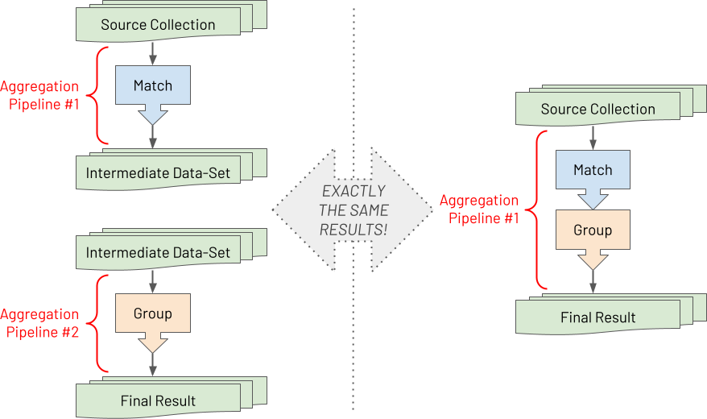

# Embrace Composibility For Increased Productivity

As described in this book's introduction, an aggregation pipeline is an ordered series of declarative statements, called stages, where the entire output of one stage forms the entire input of the next stage, and so on, with no side-effects. Pipelines exhibit high [composability](https://en.wikipedia.org/wiki/Composability) where stages are stateless self-contained components that can be selected and assembled in various combinations (pipelines) to satisfy specific requirements. This composability helps to promote iterative prototyping, with painless testing after each increment.

With MongoDB's aggregations, a complex problem requiring a complex aggregation pipeline can simply be broken down in to individual straightforward stages, where each stage can be developed and tested in isolation first. To better comprehend this composability, it can help to internalise the following visual model. 



Essentially, if you have two pipelines with one stage in each and you run the second pipeline after successfully completing the first pipeline, the final output result set is exactly the same as if you have just run a single pipeline containing both stages serially. There no difference between the two. By understanding how a problem can be broken down in this way when building aggregation pipelines, it helps to reduce the [cognitive load](https://en.wikipedia.org/wiki/Cognitive_load) on you as a developer. Aggregation pipelines enable you to break down a big problem into lots of small problems and by embracing this approach of first developing each stage separately, then even the most complex challenges become surmountable. 

## Specific Tips To Promote Composability

Now in reality, once most developers become adept at using the Aggregation Framework, they tend not to rely on temporary intermediate collections whilst prototyping each stage, although it is still a valid development approach if you prefer it. Instead, seasoned aggregation pipelines developers typically just comment out one or more stages of an aggregation pipeline when using the Mongo Shell (or use the 'disable stage' capability provided by the [GUI tools](./getting-started.html) for MongoDB).

To encourage composability and hence productivity, some of the principles to strive for are:

 * Easy disabling of subsets of stages, whilst prototyping
 * Easy addition of new fields to a stage or new stages to a pipeline by performing a copy, a paste and then a modification, without hitting cryptic error messages which result from issues like missing out a comma before the newly added item
 * Easy appreciation, at a glance, of each distinct stage's purpose

With these principles in mind, the following is an opinionated list of guidelines for the way you should textually craft your pipelines in JavaScript, to improve your pace of pipeline development.
 1. Don't start or end a stage on the same line as another stage
 2. For every field in a stage, and for every stage in a pipeline, include a trailing comma even if it is currently the last item
 3. Include an empty newline between every stage
 4. For complex stages include a `//` comment with an explanation, on a newline, before the stage
 5. To 'disable' some stages of a pipeline whilst prototyping another stage, just use the multi-line comment `/*` prefix and `*/` suffix

Below is an example of a poor pipeline layout, where none of the guiding principles have been followed:

```javascript
// BAD

var pipeline = [
  {"$unset": [
    "_id",
    "address"
  ]}, {"$match": {
    "dateofbirth": {"$gte": ISODate("1970-01-01T00:00:00Z")}
  }}//, {"$sort": {
  //  "dateofbirth": -1
  //}}, {"$limit": 2} */
];
```

Whereas the following is an example of far better pipeline layout, where all of the guiding principles are met:

```javascript
// GOOD

var pipeline = [
  {"$unset": [
    "_id",
    "address",
  ]},    
    
  // Only match people born on or after 1st Janurary 1970
  {"$match": {
    "dateofbirth": {"$gte": ISODate("1970-01-01T00:00:00Z")},
  }},
  
  /*
  {"$sort": {
    "dateofbirth": -1,
  }},      
    
  {"$limit": 2},  
  */
];
```

Notice trailing commas are included above, at both the end of stage and end of field levels.

It is also worth mentioning that some (but not all) developers take a slightly different but equally valid approach to constructing a pipeline. They decompose each stage in the pipeline into different JavaScript variables, where each stage variable is defined separately, as show in the example below:

```javascript
// GOOD

var unsetStage = {
  "$unset": [
    "_id",
    "address",
  ]};    

var matchStage = {
  "$match": {
    "dateofbirth": {"$gte": ISODate("1970-01-01T00:00:00Z")},
  }};

var sortStage = {
   "$sort": {
    "dateofbirth": -1,
  }}; 


var limitStage = {"$limit": 2};
    
var pipeline = [
  unsetStage,
  matchStage,
  sortStage,
  limitStage,
];
```

This book is not advocating this 'multi-variable' approach over a 'single-variable' approach to defining a pipeline. It is just highlighting another highly composable option. Ultimately it is a personal choice about which you find most comfortable and productive. Indeed, some developers will go a step further, if not intending to transfer the prototyped pipeline to another programming language. They will factor out complex boilerplate parts of their pipeline into separate JavaScript functions, which can be re-used from multiple places within their main JavaScript based pipeline.

