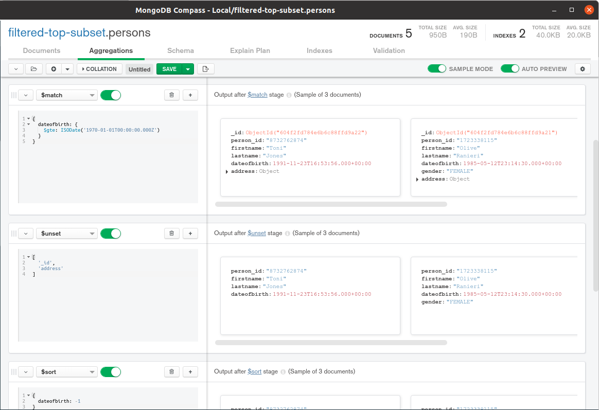
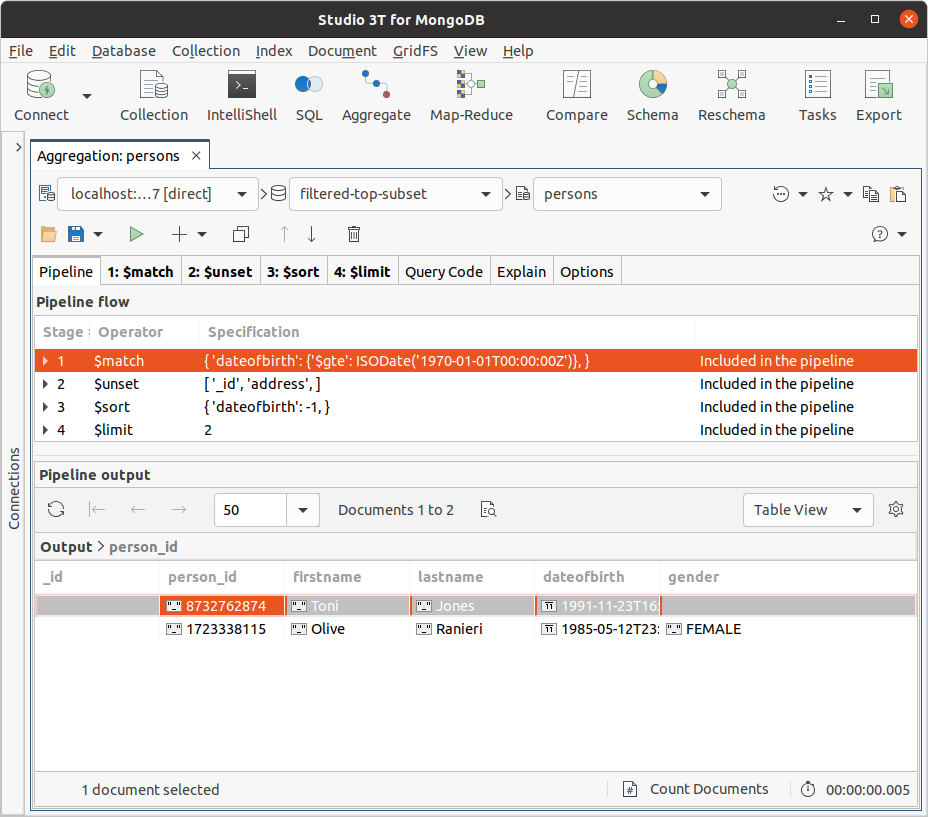

# Getting Started

To try the examples in the second half of this book you need the following two elements:

 1. A __MongoDB database__, __version 4.2 or greater__, running somewhere which is network accessible from your workstation
 2. A __MongoDB client tool__ running on your workstation with which to submit aggregation execution requests and to then view the results

Note, each example is marked with the minimum version of MongoDB it will successfully execute on, but from a minimum of version 4.2 onwards. For MongoDB versions 4.0 and earlier, some examples may work unchanged, some examples may work with minor alterations and some may not work at all due to fundamental dependencies on stages or operations which were added in MongoDB versions 4.2 or greater.

## Database

The database to connect to could be a MongoDB version 4.2+ deployment which is single-server, a replica-set or a sharded cluster running locally on your workstation or remotely on-prem or in the cloud. It doesn't matter which. You just need to know the MongoDB URL for connecting to the database (including any authentication credentials required for full read and write access).

If you don't already have access to a MongoDB database, the two easiest options for running one, for free, are:

 1. [Install and run a MongoDB single server](https://docs.mongodb.com/guides/server/install/) locally on your workstation
 2. [Provision a Free Tier MongoDB Cluster](https://docs.atlas.mongodb.com/tutorial/deploy-free-tier-cluster/) in MongoDB Atlas which is MongoDB Inc.'s cloud-based Database-as-a-Service (once deployed, in the Atlas Console there is button you can click to copy the URL of the cluster)


## Client Tool

There are many options the the client tool, four of which are:

 1. __*Modern* Shell__. Install the modern version of MongoDB's command line tool, the [Mongo Shell](https://www.mongodb.com/try/download/shell): `mongosh`
 2. __*Legacy* Shell__. Use the legacy version of MongoDB's command line tool, the [Mongo Shell](https://docs.mongodb.com/manual/mongo/): `mongo` (this binary is bundled with a MongoDB database installation or can be downloaded from the Atlas console)
 3. __Compass__. Install the _official_ MongoDB Inc. provided graphical user interface (GUI) tool, [MongoDB Compass](https://www.mongodb.com/products/compass)
 4. __Studio 3T__. Install the _3rd party_ 3T Software Labs provided graphical user interface (GUI) tool, [Studio 3T](https://studio3t.com/download/)
 
The examples provided in this book are presented in such a way to make it easy to cut and paste the code into the Mongo Shell (`mongosh` or `mongo`) to be executed. All subsequent instructions in this book will assume you are using the Shell. However, you should find it straight-forward to use one of the mentioned GUI tools instead, to consume the code examples provided. Of the two Shell versions, you will be likely to find the _modern_ Shell easier to use and view results with.


### Mongo Shell With Local Database

Here is an example of starting the _modern_ Mongo Shell to connect to a MongoDB single-server database if you've installed one locally on your workstation (change the text `mongosh` to `mongo` if you are using the _legacy_ Shell):

```bash
mongosh "mongodb://localhost:27017"
```

### Mongo Shell With Atlas Database

Here is an example of starting the _modern_ Mongo Shell to connect to a Atlas Free Tier MongoDB Cluster (change the text `mongosh` to `mongo` if you are using the _legacy_ Shell):

```bash
mongosh "mongodb+srv://mycluster.a123b.mongodb.net/test" --username myuser
```

Note, before running the command above, ensure
 1. You have [added your workstation's IP address](https://docs.atlas.mongodb.com/security/add-ip-address-to-list/) to the Atlas Access List
 2. You have [created a database user](https://docs.atlas.mongodb.com/tutorial/create-mongodb-user-for-cluster/) for the deployed Atlas cluster, with rights to create, read and write to any database
 3. You have changed the dummy URL and username text, shown in the above example command, to match your real cluster's details, which are accessible via the `Connect` button in the Atlas Console


### MongoDB Compass GUI

MongoDB Compass provides an _Aggregation Pipeline Builder_ tool to assist users to prototype and debug aggregation pipelines and then export them for use in different programming languages. Below is a screenshot of this tool in Compass:




### Studio 3T GUI

Studio 3T provides an _Aggregation Editor_ tool to help users to prototype and debug aggregation pipelines and then translate them for use in different programming languages. Below is a screenshot of this tool in Studio 3T:



